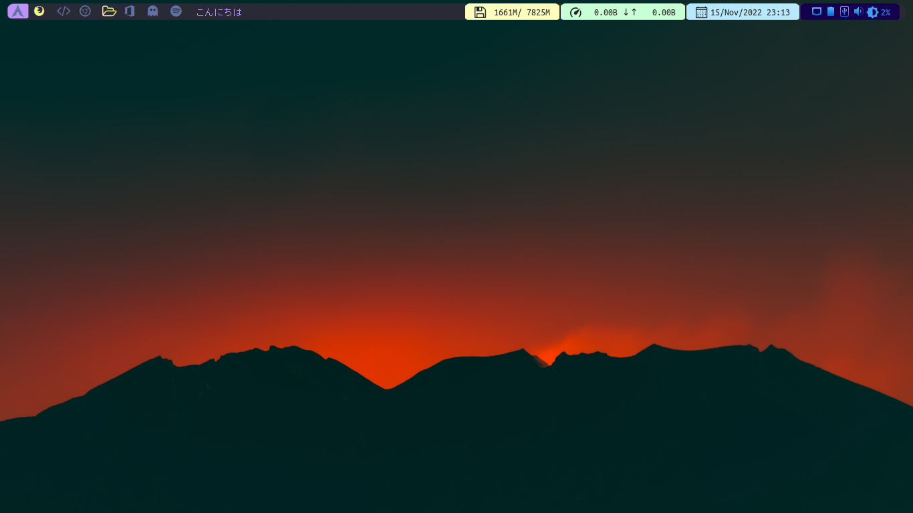

# My Qtile Setup



# Índice

-   [Atajos de teclado](#atajos-de-teclado)
-   [Paquetes Necesarios](#paquetes-necesarios)
-   [Fuentes](#fuentes)
-   [Iconos y Temas](#iconos-y-temas)
-   [Agradecimientos](#agradecimientos)

# Atajos de teclado

mod = Tecla Windows

| Atajo                   | Acción                            |
| ----------------------- | --------------------------------- |
| **F7**                  | Aumentar brillo de pantalla       |
| **F6**                  | Disminuir brillo de pantalla      |
| **mod + q**             | Cerrar ventana                    |
| **mod + space**         | Abre Ulauncher o Rofi             |
| **mod + f**             | Abrir Firefox                     |
| **mod + c**             | Abrir Chrome                      |
| **mod + Print**         | Tomar Captura de Pantalla (gnome) |
| **mod + Print**         | Tomar Captura de Pantalla (scrot) |
| **mod + shift + Print** | Tomar Captura de Pantalla (xfce)  |
| **mod + b**             | Oculta/Muestra la barra           |
| **mod + p**             | Abre kcolorchooser(Color Picker)  |

# Paquetes Necesarios

| Nombre de paquete       | Descripción                                  |
| ----------------------- | -------------------------------------------- |
| **cmus**                | Reproductor de música CLI                    |
| **playerctl**           | Permite controlar la música desde el teclado |
| **psutil**              | Tools Necesario para Qtile                   |
| **iwlib**               | Visibilidad de Wifi en Qtile                 |
| **scrot**               | CLI para tomar ScreeShots                    |
| **gnome-screenshot**    | GUI para tomar ScreeShots                    |
| **xfce4-screenshooter** | GUI para tomar ScreeShots                    |
| **xorg-xbacklight**     | Permite Aum/Dism brillo de pantalla          |
| **gnome-keyring**       | Permite guardar contraseñas útil para VSC    |
| **kcolorchooser**       | Color Picker para Linux                      |
| **Ulauncher**           | Lanzador de Aplicaciones (opcional)          |

# Fuentes

| Nombre            | Descarga                                 |
| ----------------- | ---------------------------------------- |
| **Windows Fonts** | bit.ly/winfonts                          |
| **nerfonts**      | yay -S nerd-fonts-complete               |
| **MesloLGS NF**   | yay -S ttf-meslo-nerd-font-powerlevel10k |

1. Instalación de Windows Fonts

```BASH
sudo chmod 777 WindowsFonts
sudo cp -r WindowsFonts /usr/share/fonts
```

# Iconos y Temas

| Nombre | Tipo | Descarga |
| --- | --- | --- |
| **Sweet-Dark-v40** | Theme | bit.ly/Sweet-Dark-v40 |
| **Material-Black-Blueberry-Suru** | Icons | bit.ly/Material-Black-Blueberry-Suru |

-   Links en Gnome Look
    -   Sweet-Dark-v40: https://www.gnome-look.org/p/1253385/
    -   Material-Black-Blueberry-Suru: https://www.gnome-look.org/p/1333360/

1. Instalación de Temas

```BASH
mv Sweet-Dark-v40 ~/.themes
```

2. Instalación de Iconos

```BASH
mv Material-Black-Blueberry-Suru ~/.icons
```

# Agradecimientos

Esta configuración fue realizada siguiento su guía de instalación del canal **mundojuancri**, dejo su canal de Youtube por aquí **https://www.youtube.com/c/mundojuancri** para su instalación manual
